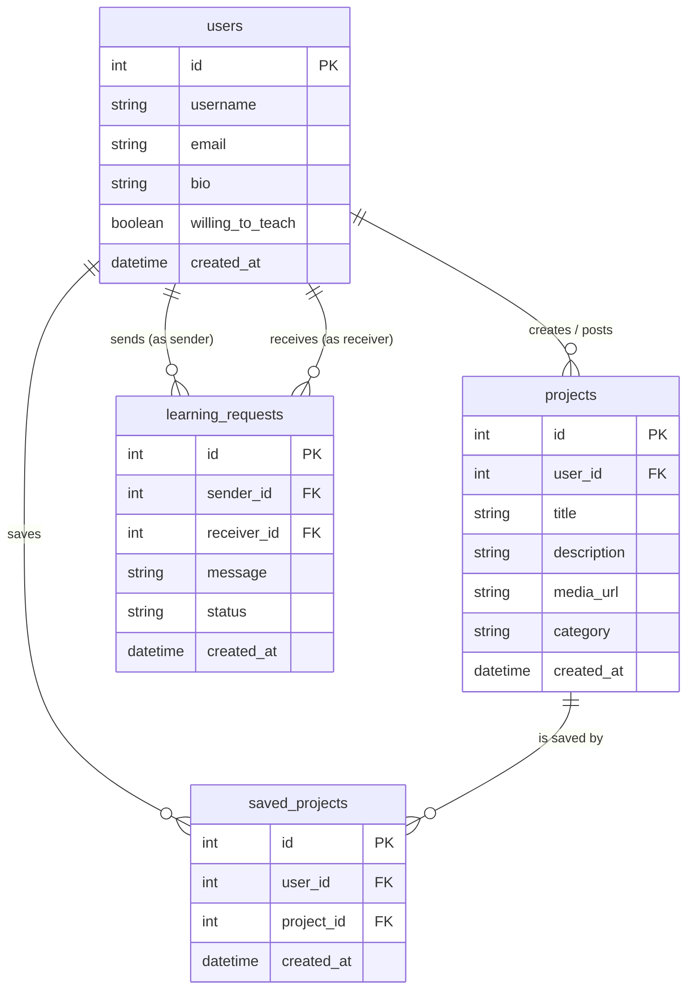

```mermaid
erDiagram
    users ||--o{ projects : "creates / posts"
    users ||--o{ learning_requests : "sends (as sender)"
    users ||--o{ learning_requests : "receives (as receiver)"
    users ||--o{ saved_projects : "saves"
    projects ||--o{ saved_projects : "is saved by"

    users {
        int id PK
        string username
        string email
        string bio
        boolean willing_to_teach
        datetime created_at
    }

    projects {
        int id PK
        int user_id FK
        string title
        string description
        string media_url
        string category
        datetime created_at
    }

    learning_requests {
        int id PK
        int sender_id FK
        int receiver_id FK
        string message
        string status
        datetime created_at
    }

    saved_projects {
        int id PK
        int user_id FK
        int project_id FK
        datetime created_at
    }
```